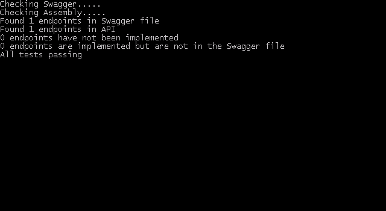

# SwaggerCheck

SwaggerCheck is a tool to check that the path and parameters described in the Swagger documentation matches the built API, so that developers can spend less time combing through the lines of YAML/JSON to find inconsistencies. **SwaggerCheck is currently only compatible with ASP.NET Core API projects, and does not check output.**

## Getting Started

SwaggerCheck is a self-contained .NET Core application and does not require .NET Core to be installed.

### Creating the executable

The executable needs to be built for your system using the following command:

```
dotnet publish -c release -r [target runtime]
```

For example:

```
dotnet publish -c release -r win10-x64
```
Check the [.Net RID Catalog](https://docs.microsoft.com/en-us/dotnet/core/rid-catalog) for a list of valid values for the `-r` option.

## Using the program

SwaggerCheck requires 2 arguments: the path to the Swagger file provided with the -s option, and the path to the outputted binary for the API provided with the -b option.
It also supports an optional which will exit the program with a non-zero status code if the Swagger specifications and API don't strictly match.

### Windows

Below is an example of how SwaggerCheck would be used in a Windows system.

```
SwaggerCheck.exe -b "[Path to API repository]\bin\Debug\netcoreapp1.1\TestApi.dll" -s "[Path to API repository]\swagger.json"
```

And an example output:  



## Contributing

Examples for SwaggerCheck being used on other systems would be greatly appreciated, as well as any suggestions to improve SwaggerCheck.

## License

This project is licensed under the MIT License - see the [LICENSE.md](LICENSE.md) file for details
